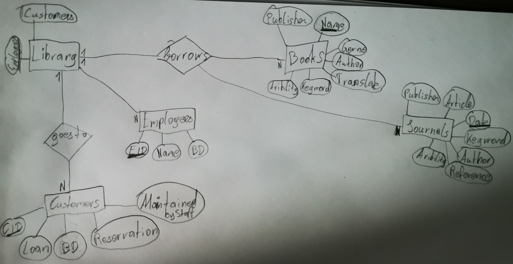

# Library-ERM
A library manages books and journals. Each book is published by a publishing house, there may be several copies of each book, which can also be borrowed by customers. There are published issues of the journals, these are only available once, a loan is not possible.
The articles published in the journals as well as the books should be managed in such a way that comfortable functions for information retrieval are possible: In addition to the assignment of a subject area, there should also be a keyword, whereby the relevance of each assigned keyword is important. Synonymous keywords should be recorded. Articles and books can each have several authors. Certain books can each have one book as a translation template, articles can reference each other:
Each borrowing is handled by one employee, and one employee is also responsible for returning the book copy.
Customers can also reserve books, each reservation usually results in a loan. The books and magazines are stored on shelves. A journal is placed on a shelf, and each shelf is assigned a subject area for the storage of the books.

# Finish

Library (Employees: varchar, Customers: varchar)
Customers (CID: int, Loan: varchar, BD: date, Reservation: varchar, MaintainedByStaff: varchar)
Employees (EID: int, Name: varchar, BD: date)
Books (Name: varchar, Publisher: varchar, Gerne: varchar, Author: varchar, Translate: tinytext, Keyword: tinytext, Avibility: boolean)
Journals (Date: date, Publisher: varchar, Article: varchar, Author: varchar, Keyword: tinytext, Reference: varchar, Avibility: boolean)

